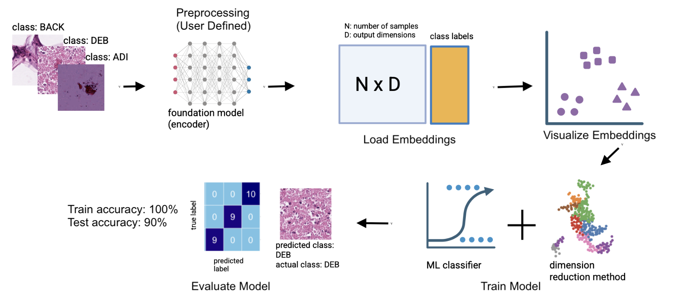

# HistoLearn

## Description:
The clinical practice of pathology involves tasks such as tumor detection and 
stage classification on hematoxylin and eosin (H&E) tissue images. With the advancement of AI 
and computational biology, many of these tasks can now be automated. Recently 
developed pathology foundation models, or general-purpose encoders, 
can process regions of  interest (ROIs) or whole-slide images (WSIs) and 
generate high-dimensional feature embeddings that summarize histological 
patterns. These embeddings can then serve as inputs for downstream analyses 
and predictive modeling, including classification and segmentation tasks (Chen et al., 2024).

HistoLearn provides a workflow for computational pathology that integrates 
downstream analysis (including interpretation, visualization, and modeling) of 
H&E embeddings generated from pathology foundation models. It enables users to 
load H&E embeddings with their class labels, perform dimensionality reduction, 
train classifiers, and evaluate performance. The package implements a simple 
pipeline combining principal component analysis (PCA) and k-nearest neighbors 
(kNN), inspired by the common workflows used in pathology foundation models 
(Chen et al., 2024). HistoLearn offers an all-in-one framework for the 
interpretation and predictive modeling of high-dimensional histological 
embeddings.

This package was developed under R 4.5.1 (2025-06-13) on macOS Sonoma
14.5 (aarch64-apple-darwin20).

## Installation

To install the latest version of the package:

```         
install.packages("devtools")
library("devtools")
devtools::install_github("yuxizzz/HistoLearn", build_vignettes = TRUE)
library("HistoLearn")
```

To run the shinyApp: Under construction

## Overview:

Full tutorial is available on vignettes.
```         
ls("package:HistoLearn")
data(package = "HistoLearn")
browseVignettes("HistoLearn")
```

### Overview diagram


The workflow diagram is drawn using BioRender and the example H&E images are from
Kather et al. (2018). 


### Main functions

| Function | Description |
|---------------------------------|---------------------------------------|
| `load_embeddings(feature, label = NULL)` | Load features and labels into a `"histofeature"` object with validation. |
| `visualize_embeddings(input_data, dimensions = 2, type = "pca")` | Perform PCA projection and generate 2D or pairwise embedding plots. |
| `train_model(feature_embedding, dr = "pca", dr_k = 20, model = "knn")` | Apply PCA reduction and train a k-NN classifier. Output a `histolearn` object for the final model. |
| `evaluate_model(trained_model, test_data)` | Evaluate predictions on a test set, visualize confusion matrix, and compute accuracy. |

### Example Data

-   `train_embeddings`, `train_labels` — training set (9 human
    colorectal cancer issue classes) from Kather, Halama, and Marx
    (2018).
-   `test_embeddings`, `test_labels` — independent test set of same structure as 
the training set for model evaluation.

## Contributions:

This package was designed and implemented by Yuxi Zhu. The workflow is inspired 
by the common practice outlined in Chen et al. (2024). All documentation and 
example workflows were written by Yuxi Zhu. The example data is derived from 
Kather et al. (2018) and processed using the pathology foundation model UNI 
from Chen et al. (2024). The author conducted data preprocessing to prepare 
example embeddings and structured training/test datasets. The `stats` package 
is used for PCA computation; `caret` is used for k-NN model training and 
cross-validation. `ggplot2` and `GGally` are used for visualization. 
`ChatGPT-5` from OpenAI was used to polish and format documentation, debug code, 
and look up functions.

## References:

```         
Chen, R. J., Ding, T., Lu, M. Y., Williamson, D. F. K., Jaume, G.,
Song, A. H., Chen, B., Zhang, A., Shao, D., Shaban, M., Williams, M.,
Oldenburg, L., Weishaupt, L. L., Wang, J. J., Vaidya, A., Le, L. P., Gerber,
G., Sahai, S., Williams, W., & Mahmood, F. (2024). Towards a general-purpose
foundation model for computational pathology. Nature Medicine, 30(3), 850–862.
https://doi.org/10.1038/s41591-024-02857-3

Kuhn, M. (2008). Building Predictive Models in R Using the caret Package. 
Journal of Statistical Software, 28(5), 1–26. https://doi.org/10.18637/jss.v028.i05

R Core Team (2025). _R: A Language and Environment for
Statistical Computing_. R Foundation for Statistical Computing,
Vienna, Austria. <https://www.R-project.org/>.

H. Wickham. ggplot2: Elegant Graphics for Data Analysis.
Springer-Verlag New York, 2016.

Sarkar D (2008). _Lattice: Multivariate Data Visualization with
R_. Springer, New York. ISBN 978-0-387-75968-5,
<http://lmdvr.r-forge.r-project.org>.

Schloerke B, Cook D, Larmarange J, Briatte F, Marbach M, Thoen E,
Elberg A, Crowley J (2025). _GGally: Extension to 'ggplot2'_.
doi:10.32614/CRAN.package.GGally
<https://doi.org/10.32614/CRAN.package.GGally>, R package
version 2.4.0, <https://CRAN.R-project.org/package=GGally>.

Kather, J. N., Halama, N., & Marx, A. (2018). 100,000 histological images of
human colorectal cancer and healthy tissue (v0.1) \[Data set\]. Zenodo.
https://doi.org/10.5281/zenodo.1214456
```

## Acknowledgements:

This package was developed as part of an assessment for 2025 BCB410H:
Applied Bioinformat- ics course at the University of Toronto, Toronto,
CANADA. HistoLearn welcomes issues, enhancement requests, and other
contributions. To submit an issue, use the GitHub issues.

## Other Topics:
